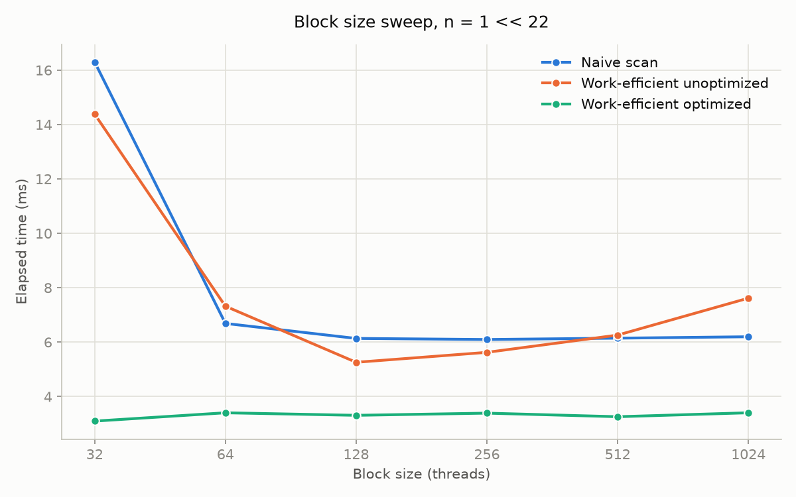
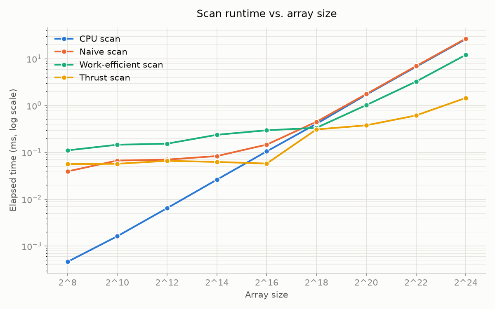
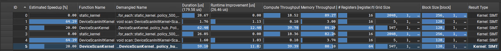

CUDA Stream Compaction
======================

**University of Pennsylvania, CIS 565: GPU Programming and Architecture, Project 2**

* Gordon Kim
* Tested on: Windows 11, i7-12700 @ 2.10GHz 32GB, T1000 4GB (CETS Computer)

## Overview

This project implements GPU approaches to the `scan` (prefix sum) and stream compaction, comparing them against a single-threaded CPU baseline.

Features Implemented:
- CPU scan
- Naive GPU scan
- Work-efficient GPU scan / compact (unoptimized and optimized)
- Thrust scan

Files Edited:
- `stream_compaction/CMakeLists.txt:34` for build erros on CETS machine

## Performance Analysis

All timings below were run from a **Release** build. All measurements were taken as the average across 10 runs.

### 1. Block size optimization

Block size sweep was run with input array size `n = 1 << 22`.

| Block Size | Naive (ms) | Efficient unoptimized (ms) | Efficient optimized (ms) |
|------------|------------|----------------------------|--------------------------|
| 32         | 16.297110  | 14.380449                  | 3.097712                 |
| 64         | 6.688086   | 7.321654                   | 3.403789                 |
| 128        | 6.136938   | 5.259683                   | 3.310534                 |
| 256        | 6.097683   | 5.625456                   | 3.390698                 |
| 512        | 6.146659   | 6.259744                   | 3.259305                 |
| 1024       | 6.198649   | 7.617779                   | 3.404112                 |



Naive is slow at block size 32 (16.30ms) then flattens out for block size >= 64 (~6.1-6.2ms). Efficient unoptimized dips to a minimum at 128 (5.26ms) and rises again toward 1024 (7.62ms). Efficient optimized stays relatively flat across all block sizes, but has a minimum at the smallest block size 32 (3.10-3.40ms).

Chosen block size for array size comparison:
- Naive: 256
- Work-efficient unoptimized: 128
- Work-efficient optimized: 32

### 2. Performance

Only power-of-two array sizes are plotted, for clarity — all implementations exhibited the same trends on non-power-of-two sizes as they are padded to the next power of two array, creating effectively equal amount of work (minor discrepancies with operations on 0, but overall follows the same pattern).



Raw data table backing the graph:

| Array Size | CPU (ms) | Naive (ms) | Efficient Unoptimized (ms) | Efficient optimized (ms) | Thrust (ms) |
|------------|----------|------------|----------------------------|--------------------------|-------------|
| 2^8        | 0.000460 | 0.039235   | 0.145581                   | 0.110387                 | 0.056317    |
| 2^10       | 0.001620 | 0.066992   | 0.221133                   | 0.145709                 | 0.057075    |
| 2^12       | 0.006440 | 0.070064   | 0.228301                   | 0.153421                 | 0.065978    |
| 2^14       | 0.026140 | 0.083450   | 0.299050                   | 0.237494                 | 0.062515    |
| 2^16       | 0.104950 | 0.146333   | 0.365222                   | 0.296310                 | 0.057686    |
| 2^18       | 0.407690 | 0.450934   | 0.301325                   | 0.334458                 | 0.309242    |
| 2^20       | 1.704530 | 1.758330   | 0.918800                   | 1.021904                 | 0.378067    |
| 2^22       | 6.731160 | 6.963815   | 3.323322                   | 3.250496                 | 0.614560    |
| 2^24       | 26.25754 | 26.96099   | 21.59950                   | 12.11166                 | 1.455587    |

### 3. Observations

CPU scan is fastest at small array sizes due to generally low overhead. Naive reads/writes the full array on every one of its passes. Work-efficient touches only O(n) elements total but pays for it with `2 log2(n)` kernel launches. Thrust's `DeviceScanKernel` reads and writes each element about once with coalesced access. CPU stays fastest through `n = 2^16` (0.10ms vs. Efficient 0.30ms, Naive 0.15ms). Efficient overtakes CPU between `2^16` and `2^18` and stays ahead, ~2x faster by `2^24` (12.1ms vs. 26.3ms). Thrust overtakes CPU earlier, between `2^14` and `2^16`, and is ~18x faster by `2^24`. Naive never overtakes CPU in this range (26.96ms vs. 26.26ms at `2^24`).

At the largest array size tested, `2^24`, optimized work-efficient scan was 12 ms compared to unoptimized at 21 ms.



For the thrust analysis, I went to office hours on Wednesday, Sept 16, due to my admin issues with CETS computers. I had attempted to get set up with Saahil in office hours but was unsuccessful within the given time. I will be provided admin access for the graphics computers for future projects for profiling. The image and analysis will be from the NSight extension of Visual Studio, but not profiled timeline required from NSight Compute.

Nsight shows that `thrust::scan` primarily spends its time in the internal `DeviceScanKernel`, which takes about 60 µs compared to only 1.7 µs for initialization. The scan is relatively memory-intensive, with 80 - 84% memory throughput versus 40% compute throughput, indicating that memory access is a larger factor than computation.

### 4. Extra credit (if attempted)

- **Part 5 (why is work-efficient slow)**: unoptimized `scanOnDevice` always launches `n` threads per level, but the optimized `scanOnDeviceOptimized` launches only `numActive = n/stride` threads per level. Measured at `n = 1<<22`, sweeping block size (mean of 10 runs each):

  | Block Size | Unoptimized (ms) | Optimized (ms) |
  |------------|------------------|----------------|
  | 32         | 14.380449        | 3.097712       |
  | 64         | 7.321654         | 3.403789       |
  | 128        | 5.259683         | 3.310534       |
  | 256        | 5.625456         | 3.390698       |
  | 512        | 6.259744         | 3.259305       |
  | 1024       | 7.617779         | 3.404112       |

  Optimized is 2-4x faster than unoptimized across every block size, and flat (3.10-3.40ms) where unoptimized varies widely (5.26-14.38ms). At `n = 1<<22`, optimized (~3.1-3.4ms) beats CPU (~6.7ms); unoptimized does not.

## Program Output

```
****************
** SCAN TESTS **
****************
    [  39  18  23  22  31  26  11  16  48   1  11  49  48 ...   6   0 ]
==== cpu scan, power-of-two ====
   elapsed time: 1.8185ms    (std::chrono Measured)
    [   0  39  57  80 102 133 159 170 186 234 235 246 295 ... 25695933 25695939 ]
==== cpu scan, non-power-of-two ====
   elapsed time: 1.7629ms    (std::chrono Measured)
    [   0  39  57  80 102 133 159 170 186 234 235 246 295 ... 25695834 25695846 ]
    passed
==== naive scan, power-of-two ====
   elapsed time: 3.58774ms    (CUDA Measured)
    passed
==== naive scan, non-power-of-two ====
   elapsed time: 1.60349ms    (CUDA Measured)
    passed
==== work-efficient scan, power-of-two ====
   elapsed time: 1.92502ms    (CUDA Measured)
    passed
==== work-efficient scan, non-power-of-two ====
   elapsed time: 0.921632ms    (CUDA Measured)
    passed
==== thrust scan, power-of-two ====
   elapsed time: 0.471712ms    (CUDA Measured)
    passed
==== thrust scan, non-power-of-two ====
   elapsed time: 0.39232ms    (CUDA Measured)
    passed

*****************************
** STREAM COMPACTION TESTS **
*****************************
    [   3   0   3   2   3   2   3   0   0   3   3   1   2 ...   0   0 ]
==== cpu compact without scan, power-of-two ====
   elapsed time: 2.1243ms    (std::chrono Measured)
    [   3   3   2   3   2   3   3   3   1   2   2   2   3 ...   2   3 ]
    passed
==== cpu compact without scan, non-power-of-two ====
   elapsed time: 2.0515ms    (std::chrono Measured)
    [   3   3   2   3   2   3   3   3   1   2   2   2   3 ...   2   2 ]
    passed
==== cpu compact with scan ====
   elapsed time: 7.1694ms    (std::chrono Measured)
    [   3   3   2   3   2   3   3   3   1   2   2   2   3 ...   2   3 ]
    passed
==== work-efficient compact, power-of-two ====
   elapsed time: 1.26531ms    (CUDA Measured)
    passed
==== work-efficient compact, non-power-of-two ====
   elapsed time: 1.1696ms    (CUDA Measured)
    passed
```

